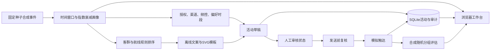
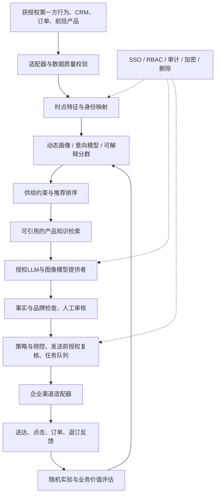

# 技术架构与替换边界

## 当前可运行架构

- `app/data.py`：固定UTC截点与合成生成器；无外部采集。
- `app/domain.py`：纯函数画像、推荐、触达决策；模板内容提供者。
- `app/service.py`：单进程线程锁、活动状态机、SQLite持久化、模拟实验。
- `app/server.py`：仅绑定回环地址，静态资源白名单和JSON接口；请求类型/大小/跨站Origin检查。
- `web/`：直接调用同源API，输出转义，SVG作为图片隔离展示；不依赖CDN。

## 企业目标架构（待实现）

这是演进设计，不表示图中模块已上线。先用模块化单体建立可验收闭环，数据量/并发确有需求后再拆服务。

## 接口约定

| 边界 | 当前实现 | 替换后的最低契约 |
|---|---|---|
| 数据 | synthetic_passengers | 按 data-contracts.md，带授权用途、事件时间、来源、版本 |
| 画像 | build_profile(passenger, as_of) | 明确as_of，禁止未来标签泄漏，解释/模型版本与更新时间 |
| 排序 | recommendations(profile) | 真实可售库存，业务约束、候选与排序理由，价格查询时间 |
| 内容 | provider.generate(profile, route) | title/body/visual引用/provider/is_aigc/review_required/prompt_version；另加模型、知识与成本信息 |
| 触达 | contact_decision + simulate | 决策与执行分离，幂等键、授权复核、调度时区、送达回执 |
| 实验 | simulated_experiment | 固定用户分组、预注册口径、真实日志、置信区间、护栏指标 |

## AIGC接入步骤

1. 选定企业许可供应商及数据传输边界；不把原始旅客事件发给外部服务。
2. 新建内容提供者实现 `generate`，服务中通过配置选择；不静默降级后标称模型已调用。
3. 仅输入批准的兴趣标签、产品事实与营销条件。记录模型ID、提示版本、知识依据、耗时和调用成本。
4. 设置超时/限额；失败保持草稿，不自动触达。输出先做结构、价格事实、敏感内容及品牌审核。
5. 增加提供者契约与故障测试，再开小范围评估。视觉图像不得暗示不存在的服务。

## 已知限制

画像与合成数据在内存中，重启重建；活动和模拟频控记录在SQLite中恢复。固定演示窗口不会自动过期，真实频控需要基于发送时间的滚动窗口。单进程锁不能提供分布式投放原子性；未来通过数据库事务/唯一幂等键与队列解决。审核没有身份认证、角色分离与不可篡改日志；不具备公网或生产部署条件。
