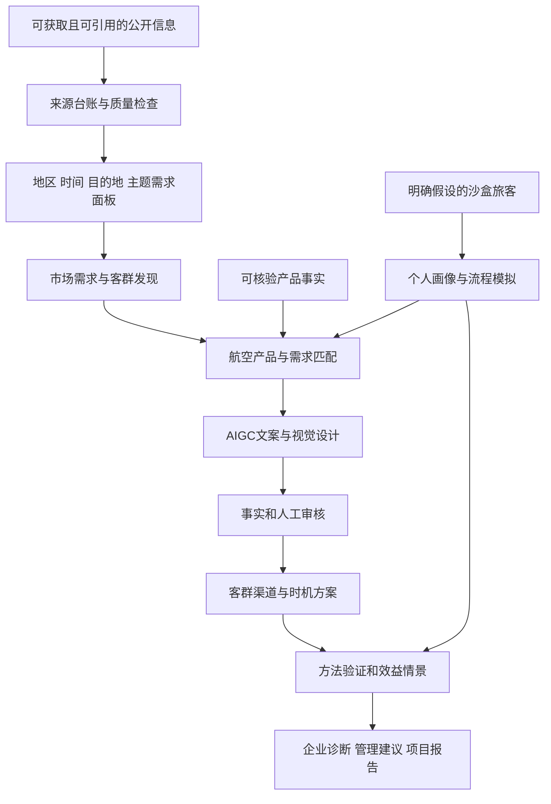

# 公开信号与沙盒研究架构

本架构是当前方案设计，不表示已开发所有模块。当前只交付研究思路及Word指南。

## 六个设计模块

| 模块 | 输入 | 输出 | 验证 |
|---|---|---|---|
| 需求洞察 | 公开趋势 旅游统计 内容主题 | 地区时间目的地需求 | 回测 热点一致性 来源质量 |
| 客群画像 | 市场需求 沙盒假设 | 群体标签 虚拟画像 | 可解释 标签稳定 敏感性 |
| 产品匹配 | 兴趣主题 公开可核验产品 | 筛选排序与理由 | 同质热门基线 失效场景 |
| AIGC设计 | 产品事实 客群标签 | 文案 视觉说明 审核记录 | 模板对照 事实 盲评 成本 |
| 渠道时机 | 客群 渠道方案 沙盒授权 | 运营策略与模拟链路 | 频控 审核 状态 反馈口径 |
| 验证价值 | 方法结果 成本假设 | 证据等级 管理与经济分析 | 不把代理或模拟当真实转化 |

公开聚合信号与个人沙盒不做真实身份映射。没有实时库存时，产品匹配属于规划方案；没有个人触达授权时，渠道属于客群方案或模拟。真实大模型接入、企业数据和实投是将来可选阶段。

## 可选实现和历史参考

上一版原型在prototypes/offline-demo/；企业集成设计保留于[参考架构](reference/enterprise-architecture.md)，不是当前主线或完成门槛。若未来实现，先用模块化单体，分别替换数据、画像、排序、内容、渠道和反馈边界，不堆叠无数据支撑的复杂模型。
