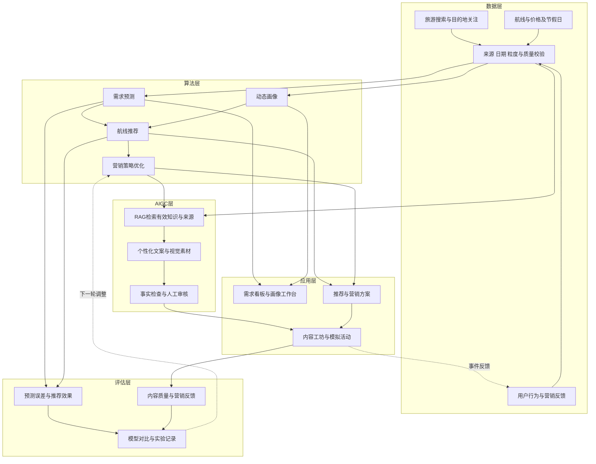

# 航旅智策五层架构

项目名称：航旅智策——节假日航空智慧营销决策系统。目标用户是航空公司营销、产品运营与内容审核人员。下面为目标设计，当前建设状态统一记录在configs/project.json。

## 层间交付

| 层 | 输入 | 输出与责任 |
|---|---|---|
| 数据 | 公开证据、获授权数据、合成场景 | 带时间及来源的数据版本；不强行关联不同来源的匿名用户 |
| 算法 | 截点前特征、供给约束、预算参数 | 需求估计、画像快照、推荐理由和渠道时机方案 |
| AIGC | 产品事实、推荐方案、脱敏标签 | 来源引用、文案、视觉素材、审核与版本记录 |
| 应用 | 数据和模型结果、操作权限 | 活动方案、人工审核、模拟执行与可追溯操作 |
| 评估 | 实验切分、对照、标签和反馈 | 指标、覆盖率、失败案例、成本与证据等级 |

所有结果携带scenario_id、data_version、as_of、source_ids及data_kind。算法另带model_version，生成另带knowledge_version与prompt_version，活动另带campaign_id。评估以这些标识关联，禁止把不同截点、数据或样本结果直接合并。

## 实现边界

采用Python模块化后端和浏览器前端的建设路线，先在单一服务中按层分模块，避免在数据尚不完备时引入分布式服务。结构化表与知识文档分开保存；检索先从可解释关键词基线开始，再比较向量检索。具体框架、模型供应商与部署方式在实现阶段确定。

公开数据支持市场洞察和历史案例；合成事件支持个人画像和闭环演示。真实旅客身份、库存、渠道与业务转化需要额外数据条件。当前框架不预设这些接口已经存在。
